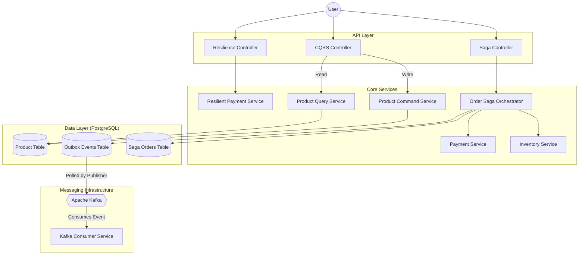

# Spring Boot Distributed System Patterns 🚀

[](https://spring.io/projects/spring-boot)
[](https://www.java.com/)
[](https://www.postgresql.org/)
[](https://kafka.apache.org/)
[](LICENSE)

A comprehensive, production-grade demonstration of advanced distributed microservices patterns implemented in Spring Boot. This project serves as a reference implementation for handling distributed transactions, data consistency, separate read/write models, and fault tolerance without relying on heavy frameworks.

## 🌟 Key Patterns Implemented

### 1. Saga Pattern (Orchestration) 🎻
Manages distributed transactions across multiple services (Order, Inventory, Payment) using a central Orchestrator.
- **Rollback Mechanism**: Implements compensating transactions (undo actions) if any step in the workflow fails.
- **State Management**: Tracks the state of every order (`CREATED` -> `INVENTORY_RESERVED` -> `PAYMENT_PROCESSED` -> `COMPLETED`).

### 2. Transactional Outbox Pattern 📤
Solves the "Dual Write Problem" (writing to the database and publishing to Kafka atomically).
- **Mechanism**: Saves the business entity (Order) and the Event (`ORDER_COMPLETED`) in the **same database transaction**.
- **Relay**: A background job (or CDC) reads the `outbox_events` table and reliably publishes messages to Kafka.
- **Tech**: PostgreSQL + Spring Scheduler + Kafka.

### 3. CQRS (Command Query Responsibility Segregation) 📖
Segregates the responsibility of writing data from reading data.
- **Command Side**: Optimized for high-performance writes and business logic validation.
- **Query Side**: Optimized for fast reads.

### 4. Resilience Patterns (Resilience4j) 🛡️
Ensures the system remains responsive even when dependencies fail.
- **Circuit Breaker**: Stops calling a failing service after a threshold is reached to prevent cascading failures.
- **Retry**: Automatically retries failed operations a configurable number of times.
- **Bulkhead**: Limits the number of concurrent calls to a specific service.

---

## 🏗️ Architecture Diagram



---

## 🛠️ Tech Stack
- **Language**: Java 17
- **Framework**: Spring Boot 3.3.0
- **Database**: PostgreSQL (Dockerized)
- **Message Broker**: Apache Kafka + Zookeeper (Dockerized)
- **Resilience**: Resilience4j
- **Build Tool**: Maven

---

## 🚀 Getting Started

### Prerequisites
- Docker & Docker Compose
- Java 17+
- Maven

### Step 1: Start Infrastructure
Spin up PostgreSQL, Kafka, and Zookeeper using Docker Compose.
```bash
docker-compose up -d
```
*   **PostgreSQL**: Port `5433` (Database: `distributed_patterns`)
*   **Kafka**: Port `9092` / `9093`
*   **Zookeeper**: Port `2181`

### Step 2: Run the Application
```bash
mvn spring-boot:run
```
The application will start on `http://localhost:8082`.

---

## 🧪 Testing the Patterns

A **Postman Collection** (`postman_collection.json`) is included in the root directory. Import it to test all endpoints easily.

### 1. Test Saga Orchestration (Happy Path)
Create an order. The system will reserve inventory, process payment, and complete the order.
```bash
curl -X POST http://localhost:8082/api/saga/orders \
-H "Content-Type: application/json" \
-d '{"customerId":"user1", "productId":"prod-001", "quantity":1, "price":100}'
```
**Verify**: Check logs for "Saga completed successfully" and "Publishing Event to Kafka".

### 2. Test Saga Compensation (Failure Path)
Try to buy an item that is out of stock. The system will rollback any previous steps.
```bash
curl -X POST http://localhost:8082/api/saga/orders \
-H "Content-Type: application/json" \
-d '{"customerId":"user1", "productId":"OUT_OF_STOCK", "quantity":1, "price":100}'
```
**Verify**: Status will be `CANCELLED` in the response.

### 3. Test CQRS
Create a product (Command) and then retrieve it (Query).
```bash
# Command
curl -X POST http://localhost:8082/api/cqrs/commands/products \
-H "Content-Type: application/json" \
-d '{"name":"iPhone 15", "price":999, "stock":10}'

# Query
curl http://localhost:8082/api/cqrs/queries/products
```

### 4. Test Circuit Breaker
Hit the resilient endpoint repeatedly. It has a simulated 60% failure rate. After enough failures, the Circuit Breaker will **OPEN** and return a fast fallback response without calling the service.
```bash
curl http://localhost:8082/api/resilience/payment
```

---

## 📊 Database Schema

### `saga_orders`
| ID | Customer | Product | Status | Failure Reason |
|----|----------|---------|--------|----------------|
| 1  | user123  | prod-001| COMPLETED | NULL |
| 2  | user123  | OUT_OF_STOCK | CANCELLED | Product is out of stock |

### `outbox_events`
| ID | Aggregate Type | Event Type | Payload | Processed |
|----|----------------|------------|---------|-----------|
| 1  | ORDER          | ORDER_COMPLETED | {...} | true      |

---

## 👤 Author
**Shivam Srivastav**

---
This project is open-source and available under the [MIT License](LICENSE).
